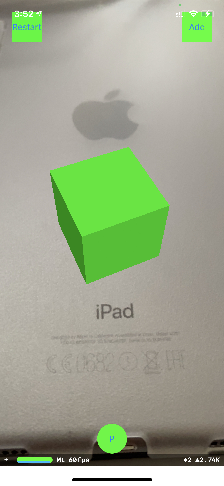

# AR-Foto

AR-Foto is an simple AR project with a photo taking feature.

This is an experimental project to support the development of the [AR Photoday project](https://github.com/ivankwongtszfung/AR-Photoday).

  

## Features

Users can **add pre-defined green cubes** on any detected planes, or **restart** the experience to clear all existing cubes.

The cubes support **translation**, **rotation** and **scaling** operations so that users can transform them in the AR environment easily. Cubes can be **removed** by tapping twice as well.

The bottom "P" button is a shutter button which users can tap to **take a picture** with the cubes instantly and save it to the device's photo album.

## Libraries

- [ARKit](https://developer.apple.com/documentation/arkit)
- [SceneKit](https://developer.apple.com/documentation/scenekit/)
